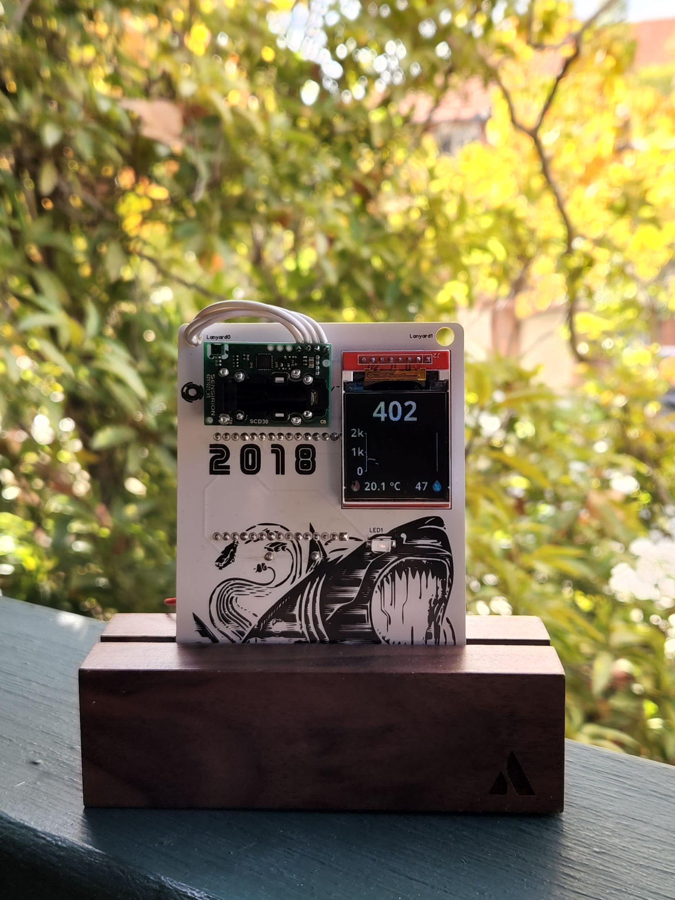
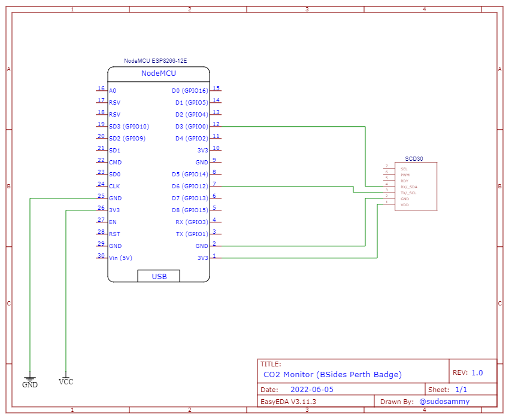
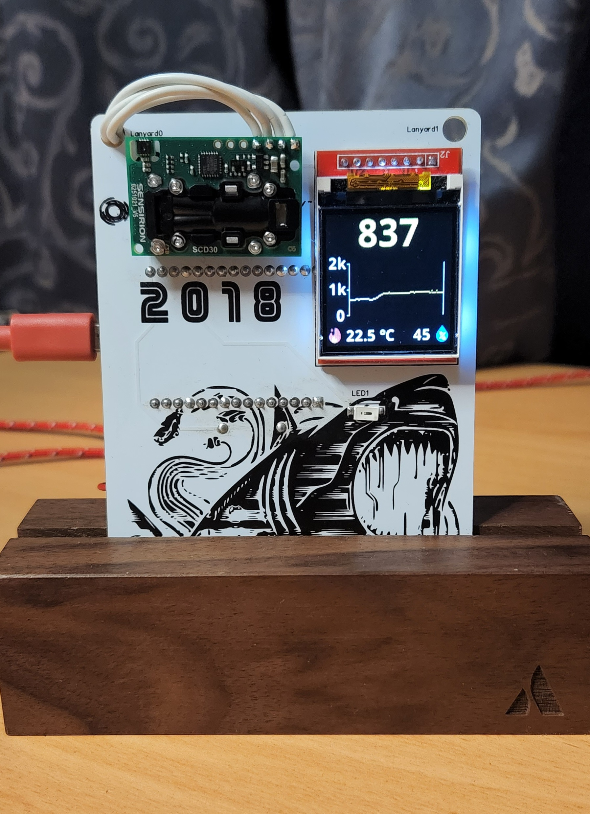
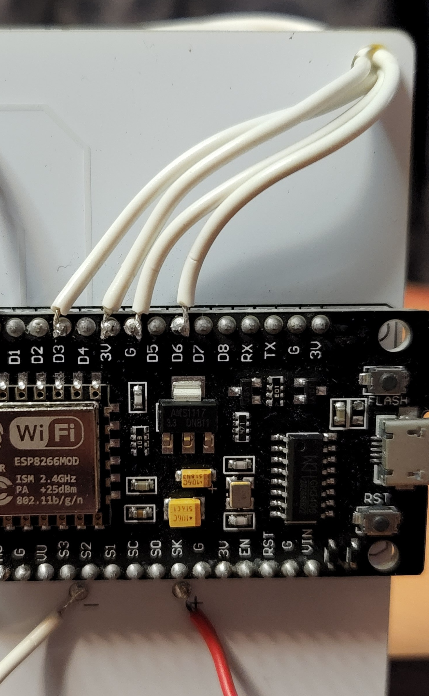
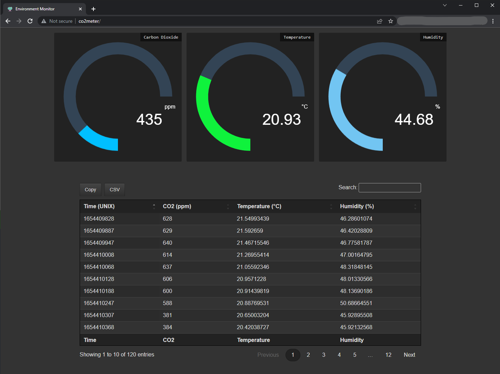

# BSides Perth 2018 Badge - Environment Monitor
A portable CO2, temperature, and humidity monitor with a WiFi-enabled dashboard, data logging & CSV export using the BSides Perth 2018 badge.

This code is compatible with any ESP8266 microcontroller but some modifications will be necessary to convert it to another badge or TFT screen.

## Features:
* Highly accurate measurements with the SCD30 sensor
* TFT screen showing the last 90 minutes of readings along with the most current CO2, temp, and humidity readings
* Visual alarm (via orange LED) when CO2 measurements exceed recommended levels
* An mDNS enabled web application with AJAX powered (auto-updating) graphs and data table
* The last 2 hours of readings are automatically logged and can be exported as CSV
* Uses primarily recycled goods!
* Total cost ~$50 AUD

## What to buy:
1. Sensirion [SCD30 sensor](https://www.aliexpress.com/item/1005001392172293.html) (this was the seller I used)
2. [2x AA Battery holder w/ switch](https://www.jaycar.com.au/2aa-switched-battery-enclosure/p/PH9280)

It's assumed you have access to a small amount of copper wire, a soldering iron, and solder.

## Schematic:
This schematic shows only the connections necessary to convert the BSides badge. If you are going to use this project with a different badge/TFT screen, you may need to make modifications here. That is outside of this project's scope.

## Compiling:
1. Install [PlatformIO](https://docs.platformio.org/en/latest/integration/ide/vscode.html#installation) for VSCode
2. Clone this repository and open it in VSCode
3. Complete the details in `src/settings.h.tpl` and rename the file to `settings.h`
    * You can set `FAKE_SENSOR` to true if you want to test this code without an SCD30. Note that the sample time for data logging is sped up in this mode.
4. `Build Filesystem Image` and `Upload Filesystem Image` via the PlatformIO "Project Tasks"
5. Build and upload the project to the NodeMCU board. There will be several warnings during compilation but hopefully no errors
6. Power cycle the board to clear the TFT and ensure everything is working as expected

## Recalibrating
The SCD30 comes calibrated but supports two methods of recalibration ([ASC and FRC](https://sensirion.com/media/documents/33C09C07/620638B8/Sensirion_SCD30_Field_Calibration.pdf)) if required. This monitor supports FRC recalibration over Wi-Fi. Visit `http://<hostname>/admin` to find the recalibration setting, ppm input must be between `400` and `2000`.

## Other notes:
1. It works (significantly) better on 5V so you might want to use a USB battery pack (like a portable phone charger) rather than running from AA batteries.
2. TODO: It's possible to increase the amount of data logged by improving the efficiency of the CircularBuffers. Some possible changes:
    * Do not store the UNIX timestamp in the buffer. Store the UNIX time of the first reading as a global then use the size of the `CircularBuffer<uint16_t,120> co2Buffer;`, adding 60 seconds for each measurement.
    * Reuse the `CircularBuffer<uint16_t,120> co2Buffer;` for the TFT graph.
    * Store temp and humidity as two `uint8_t`'s (i.e. `uint8 + "." + uint8`) rather than 32bit floats. This reduces the precision from 6 decimal places to 2 but halves the RAM required.

## Battery Life:
On typical/uninteresting Duracell AA batteries (LR6) I got 2 hours of accurate data with WiFi enabled & connected. At 2.5 hours the TFT backlight was dimming and flickering slightly and the CO2 measurements were reading a little low (100-200ppm lower) but it continued working for several hours. I suspect this is because SCD30 wants >=3.3V and that's pretty tough for two AA's. The sensor stopped reporting data just shy of 7 hours. Methods of increasing battery life:
* Disable WiFi in the settings.
* By default SCD30 takes measurements every 2 seconds. This is configurable up-to 30 minutes. Reduce the reading frequency and the number of refreshes of the TFT.

## Other Pics:

### Necessary connections for SCD30 sensor:

### Web Application (it's mobile responsive too):
